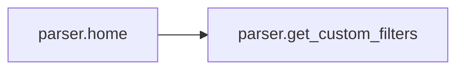
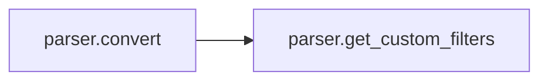

# Key Objects

[_Documentation generated by Documatic_](https://www.documatic.com)

<!---Documatic-section-filters.filter_leetify-start--->
## filters.filter_leetify

<!---Documatic-section-filter_leetify-start--->
<!---Documatic-block-filters.filter_leetify-start--->
<details>
	<summary><code>filters.filter_leetify</code> code snippet</summary>

```python
def filter_leetify(a, **kw):
    return a.replace('a', '4').replace('e', '3').replace('i', '1').replace('o', '0').replace('u', '^')
```
</details>
<!---Documatic-block-filters.filter_leetify-end--->
<!---Documatic-section-filter_leetify-end--->

# #
<!---Documatic-section-filters.filter_leetify-end--->

<!---Documatic-section-parser.get_custom_filters-start--->
## parser.get_custom_filters

<!---Documatic-section-get_custom_filters-start--->
<!---Documatic-block-parser.get_custom_filters-start--->
<details>
	<summary><code>parser.get_custom_filters</code> code snippet</summary>

```python
def get_custom_filters():
    import filters
    custom_filters = {}
    for m in getmembers(filters):
        if m[0].startswith('filter_') and isfunction(m[1]):
            filter_name = m[0][7:]
            custom_filters[filter_name] = m[1]
    return custom_filters
```
</details>
<!---Documatic-block-parser.get_custom_filters-end--->
<!---Documatic-section-get_custom_filters-end--->

# #
<!---Documatic-section-parser.get_custom_filters-end--->

<!---Documatic-section-parser.home-start--->
## parser.home

<!---Documatic-section-home-start--->


### Object Calls

* parser.get_custom_filters

<!---Documatic-block-parser.home-start--->
<details>
	<summary><code>parser.home</code> code snippet</summary>

```python
@app.route('/')
def home():
    return render_template('index.html', custom_filters=get_custom_filters())
```
</details>
<!---Documatic-block-parser.home-end--->
<!---Documatic-section-home-end--->

# #
<!---Documatic-section-parser.home-end--->

<!---Documatic-section-parser.convert-start--->
## parser.convert

<!---Documatic-section-convert-start--->


### Object Calls

* parser.get_custom_filters

<!---Documatic-block-parser.convert-start--->
<details>
	<summary><code>parser.convert</code> code snippet</summary>

```python
@app.route('/convert', methods=['GET', 'POST'])
def convert():
    jinja2_env = Environment()
    custom_filters = get_custom_filters()
    app.logger.debug('Add the following customer filters to Jinja environment: %s' % ', '.join(custom_filters.keys()))
    jinja2_env.filters.update(custom_filters)
    try:
        jinja2_tpl = jinja2_env.from_string(request.form['template'])
    except (exceptions.TemplateSyntaxError, exceptions.TemplateError) as e:
        return 'Syntax error in jinja2 template: {0}'.format(e)
    dummy_values = ['Lorem', 'Ipsum', 'Amet', 'Elit', 'Expositum', 'Dissimile', 'Superiori', 'Laboro', 'Torquate', 'sunt']
    values = {}
    if bool(int(request.form['dummyvalues'])):
        vars_to_fill = meta.find_undeclared_variables(jinja2_env.parse(request.form['template']))
        for v in vars_to_fill:
            values[v] = choice(dummy_values)
    elif request.form['input_type'] == 'json':
        try:
            values = json.loads(request.form['values'])
        except ValueError as e:
            return 'Value error in JSON: {0}'.format(e)
    elif request.form['input_type'] == 'yaml':
        try:
            values = yaml.load(request.form['values'])
        except (ValueError, yaml.parser.ParserError, TypeError) as e:
            return 'Value error in YAML: {0}'.format(e)
    else:
        return 'Undefined input_type: {0}'.format(request.form['input_type'])
    try:
        rendered_jinja2_tpl = jinja2_tpl.render(values)
    except (exceptions.TemplateRuntimeError, ValueError, TypeError) as e:
        return 'Error in your values input filed: {0}'.format(e)
    if bool(int(request.form['showwhitespaces'])):
        rendered_jinja2_tpl = rendered_jinja2_tpl.replace(' ', u'•')
    return escape(rendered_jinja2_tpl).replace('\n', '<br />')
```
</details>
<!---Documatic-block-parser.convert-end--->
<!---Documatic-section-convert-end--->

# #
<!---Documatic-section-parser.convert-end--->

[_Documentation generated by Documatic_](https://www.documatic.com)